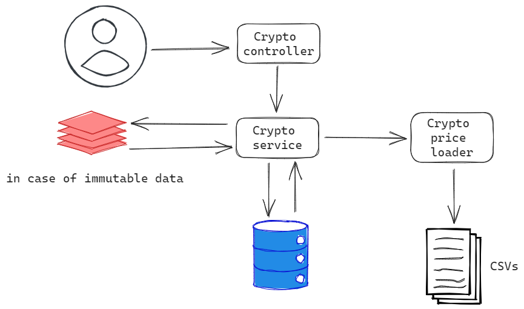
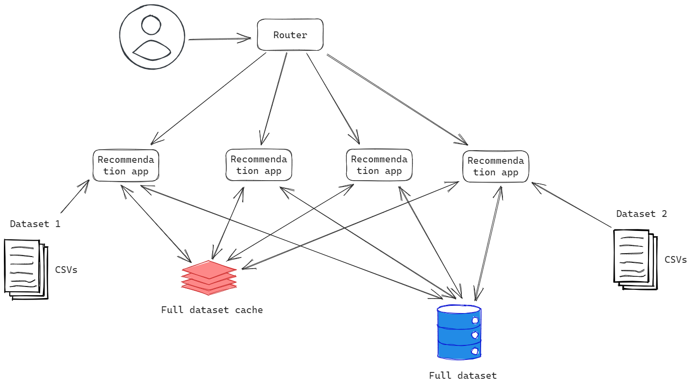

# Test task | Recommendation service

Investment recommendation service that helps users make better investment decisions

## Test task description
[List of requirements](TEST_TASK_DESCRIPTION.md)

## Requirements

- Java 17
- Maven 3.8.6 or higher

## Getting started

- Clone the project repository:
```bash
git clone https://github.com/7nolikov/recommendation-service.git
```
- Navigate to the project directory:
```bash
cd recommendation-service
```
- Install the dependencies: 
```bash
mvn clean install
```
- Start the project:
```bash
mvn spring-boot:run
```

## Swagger

| Description                              | URL                                                                       |
|------------------------------------------|---------------------------------------------------------------------------|
| OpenAPI JSON specification               | http://localhost:8080/api/recommendation-service/v1/api-docs              |
| OpenAPI YAML specification               | http://localhost:8080/api/recommendation-service/v1/api-docs.yaml         |                      
| Swagger UI                               | http://localhost:8080/api/recommendation-service/v1/swagger-ui/index.html |
| OpenAPI YAML specification file location | [./springdoc/openapi.yaml](./springdoc/openapi.yaml)                      |

## Allure Report

Allure is a flexible, lightweight multi-language test report tool, 
with the possibility of adding to the report of additional information 
such as screenshots, logs and so on.

After running your tests, an Allure report can be generated. 
It provides a clear graphical representation of test reports in a web format view. 

You can view the Allure report by opening 
[./target/site/allure-maven-plugin/index.html](./target/site/allure-maven-plugin/index.html) file.
To generate the Allure report, use the following command:

```bash
mvn allure:serve
```

## Deployment

- Build docker image
```bash
docker image build -t recommendation-service:latest .
```
- Run docker image
```bash
docker run --name recommendation-service -p 8080:8080 recommendation-service:latest
```
- Run docker-compose
```bash
docker-compose up
```

## Code style

This project follows the Google Java Style Guide. All code should be formatted to conform to this
style guide.
The Maven Checkstyle plugin is used to enforce the project style guide. You can find configuration
project's `pom.xml` file and checkstyle report in [target/site/checkstyle.html](./target/site/checkstyle.html) file.

## Target architecture



